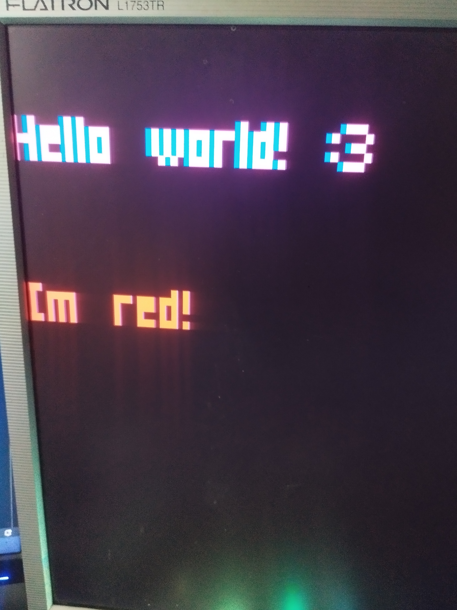

# 🌸 VGAX wrapper

Dummy wrapper for Arduino's VGAX library.

## ❓ About

I'm making my own project using Arduino Nano, I'm using VGAx library for this, it's great for its capabilities but I felt that something was missing. This wrapper was created to extend the capabilities of this library and at the same time automate some things.

## ⚠️ Notice

The number of colors is limited, due to the limitations of the VGAX library and the Arduino power itself. The colors in the library are adapted to my configuration and are given as an example of how to define colors, Arduino Nano, pin R connected to pin D6 and pin B connected to pin D7, **these colors will not be the same for you if you have the pins connected differently**.

**Be sure to change them before using the wrapper**.

**This is just an example* and these colors will be 99.9% different for you than the ones defined**. **Don't use it**.

*And a helper for me so I don't forget what colors are in my configuration.

## 💻 Functions

### DrawString

Draw string on the screen.

```cpp
void DrawString(char x, char y, const char str[] PROGMEM, byte color);
```

### DrawNumber

Draw number on the screen. It's only a workaround, because string must be `static const char[] PROGMEM` and you can't declare a dynamic function that returns a number in a constant.

Useful when you want e.g. to get the amount of EEPROM memory, or you use a mathematical function that returns a number.

```cpp
void DrawNumber(char x, char y, String number, byte color);
```

## ✨ Getting started

Ensure that you have `VGAX` library installed in Arduino.

1. Clone this repository, or [download](https://github.com/sech1p/vgax-wrapper/archive/refs/heads/main.zip) it.
2. Copy `VGA.h` file to folder with your Arduino sketch.
3. That's all, now you can use it wrapper. Enjoy~

Example usage:

```cpp
// This wrapper currently creates an instance for VGAX, so you don't need to do that anymore

#include "VGA.h"

static const char str[] PROGMEM = "Hello world! :3";
static const char str2[] PROGMEM = "Im red!";

void setup() {
    vga.begin();
    vga.clear(0);
    DrawString(0, 0, str, COLOR_NEON);
    DrawString(0, 20, str2, COLOR_RED);
}

void loop() {
    //
}
```



*Wrapper showcase on real monitor, colors will vary depending on how the color pins are connected to the Arduino (R, G, and B)*

## 🗒️ License

VGAX wrapper is [unlicensed](LICENSE).
